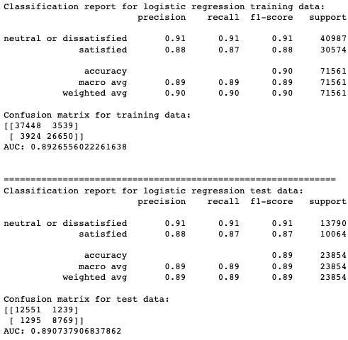

# Taking Flight: Predicting Airline Passenger Satisfaction
---
The goal was to build five different classification models to predict whether an airline passenger would be satisfied or dissatisfied. The data, obtained from [Kaggle](https://www.kaggle.com/datasets/teejmahal20/airline-passenger-satisfaction), consists primarily of survey data about passengers' travel experiences with a single unknown airline. Using F1 evaluation metrics and confusion matrices, I ultimately selected the XGBoost model as the best-performing option. It demonstrated strong performance on both training and test data, with F1 scores of **95%** for satisfied passengers and **97%** for neutral or dissatisfied passengers. The model also did well at limiting the number of misclassified passengers to **918** out of 23,854. 


### Business Understanding
---
**Explorer Airlines** has tasked me with conducting a predictive analysis of their passengers' satisfaction levels and identifying key features that have the greatest influence on customer satisfaction. In the past year, Explorer Airlines has observed a decline in customer satisfaction, and the board of executives wants to understand what the company needs to address to halt this downward trend. To address this issue, Explorer Airlines aims to gain insights into the factors influencing customer satisfaction and use this knowledge to make data-driven decisions to improve the overall travel experience.

During the pandemic, travelers enjoyed some unexpected benefits, such as fewer passengers, emptier flights, and ticket price flexibility. This led to more space on airplanes, reduced waiting times, and increased attention from flight attendants. Now that the pandemic is behind us, travelers are no longer afraid of flying, and flights are once again fully occupied. “Now, with volumes surging and some remnants of pandemic-era constraints still in place, passenger satisfaction is in decline,” Taylor says. [CN Traveler](https://www.cntraveler.com/story/travelers-satisfaction-with-us-airlines-is-at-its-lowest-point-since-the-pandemic-began)

While some may view the decrease in satisfaction as a negative development, it can also be seen as an opportunity. Michael Taylor, travel intelligence lead at J.D. Power said it best,  "If airlines can find ways to manage the growing passenger volumes and make small adjustments to help passengers feel more valued, they should be able to overcome this challenge and return to 'normal'. [CNN Travel](https://www.cnn.com/travel/article/jd-power-2022-north-american-airline-satisfaction-survey-results/index.html)

### Data Understanding
---
The dataset was mostly ordinal categorical survey data with ratings raging from 1-5. There were nominal data as well, and only two continuous data columns. 
- Number of records: 103,904
- Number of columns: 25 
- Target variable: **satisfaction**

### Column Descriptions
---
- **Gender**: Gender of the passengers (Female, Male)

- **Customer Type**: The customer type (Loyal customer, disloyal customer)

- **Age**: The actual age of the passengers

- **Type of Travel**: Purpose of the flight of the passengers (Personal Travel, Business Travel)

- **Class**: Travel class in the plane of the passengers (Business, Eco, Eco Plus)

- **Flight distance**: The flight distance of this journey

- **Inflight wifi service**: Satisfaction level of the inflight wifi service 

- **Departure/Arrival time convenient**: Satisfaction level of Departure/Arrival time convenient

- **Ease of Online booking**: Satisfaction level of online booking

- **Gate location**: Satisfaction level of Gate location

- **Food and drink**: Satisfaction level of Food and drink

- **Online boarding**: Satisfaction level of online boarding

- **Seat comfort**: Satisfaction level of Seat comfort

- **Inflight entertainment**: Satisfaction level of inflight entertainment

- **On-board service**: Satisfaction level of On-board service

- **Leg room service**: Satisfaction level of Leg room service

- **Baggage handling**: Satisfaction level of baggage handling

- **Check-in service**: Satisfaction level of Check-in service

- **Inflight service**: Satisfaction level of inflight service

- **Cleanliness**: Satisfaction level of Cleanliness

- **Departure Delay in Minutes**: Minutes delayed when departure

- **Arrival Delay in Minutes**: Minutes delayed when Arrival

- **Satisfaction**: Airline satisfaction level (Satisfaction, neutral or dissatisfaction)

### Data Cleaning and Preparation
--- 
- Drop unnecessary columns: Unnamed, id
- Format columns to use conventional python coding. Words should be lower-case and use snake case.
- Remove rows with NaN values.
- Rename elements in 'Customer Type' for easier comprehension.
- Rename certain columns for easier comprehension.
- The survey rows that contain satisfaction scores of 0 will be removed.
- The customer most likely did not indicate the score for that particular category.
- Columns, Departure Delay in Minutes and Arrival Delay in Minutes will be combined into a column called Total Delay.
- Our target variable will be changed from an object data type to a numerical data type.

### Visualizations and Top 3 Important Features 
---
**Satisfaction**
- This image shows how the data was distributed between satisfied passengers and neutral or dissatisfied passengers. 
- With a 57/43 split the data is pretty well balanced. It is worth noting however, that the data does have data in favor of dissatisfied customers.


**Customer Type: Returning Customer**
- - Returning customers is the most important feature according to my best model. 
- For airlines, they tend to be more loyal and profitable than first-time passengers.
- They have already experienced the airline's services and are satisfied enough to use them again, which means that the airline has met their expectations. 
- Returning customers also tend to be more likely to purchase additional services, such as seat upgrades, additional baggage, or airport lounge access. 
- Additionally, they are more likely to recommend the airline to others, which can help to attract new customers. - Retaining existing customers can be more cost-effective than attracting new ones.
- There were significantly more returning customers in this dataset compared to first-time customers.


**Leg Room**
- Leg room and seat comfort go hand in hand. Leg room on a flight directly affects the comfort and satisfaction of customers during their flights.
- When passengers have sufficient leg room, they are more likely to feel comfortable and relaxed, which can lead to a more enjoyable travel experience.
- Conversely, when passengers do not have enough leg room, they may feel cramped, uncomfortable, and restless, which can lead to a negative experience and even physical discomfort or pain.


**Gender Female**
- In the XGBoost model, the "gender_female" feature emerged as the third most important factor for predicting the outcome. This indicates that the gender of passengers, specifically being female, plays a significant role in determining the model's prediction.
- Some of my observations of this graph is:
    - There were more female passengers that were dissatisfied than males. 
    - The passengers that were satisfied were very close between genders, but with a slight edge in favor of males. 
    - There could be several reasons why there are more female neutral or dissatisfied passengers. 
        - Female passengers are more likely to speak out about their poor experiences. 
        - Women are not treated equally while traveling. 
        - There simply more woman in the dataset than men.


### Machine Learning Models
---
I trained 5 different machine learning classification models to predict whether an airline passenger was going to be satisfied or dissatisfied. The models that I used were the following: 
- **Logistic Regression** (Baseline model)
- **Decision Tree**
- **Random Forest**
- **Catboost** 
- **XGBoost** (Best Model)

#### Evaluation Metric : F1-Score
- F1 score is a harmonic mean of precision and recall, which are both important metrics in classification tasks. Precision measures the proportion of true positive predictions among all positive predictions, while recall measures the proportion of true positive predictions among all actual positives.


- In predicting customer satisfaction for airline passengers, both precision and recall are equally important. A high precision means that the model is making fewer false positive predictions, or in other words, correctly identifying satisfied customers. A high recall means that the model is making fewer false negative predictions, or in other words, correctly identifying dissatisfied customers.


- F1 score balances the tradeoff between precision and recall by taking into account both metrics. A high F1 score means that the model is performing well in both identifying satisfied and dissatisfied customers. Therefore, using F1 score as the evaluation metric ensures that the model is performing well in both identifying satisfied and dissatisfied customers, which is important for predicting customer satisfaction for airline passengers.

#### Logistic Regression (Baseline)
For my baseline model I chose to use **logistic regression**. The model performed well, however compared to the other classification models that I used, it ranked 5th in performance. 
    

- Though the regression model didn't perform as well as the other models, there were still some positive takeaways. 
    - The classification report for both the training and test data were close. This means that there were no signs of overfitting fitting involved. 
    - Also as a baseline model with no tuning to it, the metrics were still pretty high. 
- Looking at the confusion matrix 

#### XGBoost w/out Tuning (Best Model)
- For the XGBoost model, I ran two different models. The first model was run without any hyperparameter tuning, and the second was run using RandomSearchCV to find the optimal parameters. 
- After running both models, the results were very close. In fact, they scored the same in terms of their evaluation metrices, and off by only 3 in terms of misclassification when looking at their confusion matrices.
- The reason I chose XGBoost without tuning as the best, was because it was less computationally expensive than running it with RandsomSearchCV for just a difference of 3 misclassified passengers.  


#### Comparing XGBoost (Best Model) and Logistic Regression (Baseline Model)
- In comparing the two classification reports, it's clear that the XGBoost model outperforms the baseline Logistic Regression model in terms of accuracy, precision, recall, and F1-score for both training and test data.

- For the training data, the Logistic Regression model has an accuracy of 0.90, while the XGBoost model has an accuracy of 0.97. Similarly, for the test data, the Logistic Regression model has an accuracy of 0.89, while the XGBoost model has an accuracy of 0.96.

- The F1-scores for the Logistic Regression model are 0.91 and 0.88 for neutral or dissatisfied and satisfied passengers, respectively, on the test data. In contrast, the XGBoost model has F1-scores of 0.97 and 0.95 for the same classes. This shows that the XGBoost model has better overall performance in terms of balancing precision and recall.

- Additionally, the Area Under the Curve (AUC) scores for the Logistic Regression model are 0.8927 for the training data and 0.8907 for the test data. For the XGBoost model, the AUC scores are 0.9712 for the training data and 0.9583 for the test data. Higher AUC scores for the XGBoost model indicate that it has better classification performance overall.

#### Confusion Matrices Comparison
- In terms of misclassification, the XGBoost model does a significantly better job at reducing the number of misclassified passengers. 
    - XGBoost = **918**
    - Logistic Regression = **2534**


- In summary, the XGBoost model demonstrates superior performance over the baseline Logistic Regression model across all key evaluation metrics, making it the better choice for predicting airline passenger satisfaction.

### Conclusion
---
After extensive analysis, it is evident that Explorer Airlines should prioritize their returning customers. These customers are more likely to purchase additional services, such as seat upgrades, extra baggage allowance, or airport lounge access. Retaining customers is also more cost-effective than attracting new ones due to savings in marketing expenses and the initial bonuses awarded to new mileage program members. With this in mind, one of the goals of using this model should be to minimize the number of misclassified passengers, enabling the airline to reach out to every dissatisfied passenger effectively. To build on that goal, Explorer Airlines needs to ensure they can identify and address the concerns of every dissatisfied returning customer.

To see the full jupyter notebook project please follow this link: [Airline Passenger Satisfaction](https://github.com/MHolthouser1024/Airline-Passenger-Satisfaction/blob/master/final_notebook.ipynb)

To see the powerpoint presentation slides, please follow this link: [Powerpoint Presentation](https://github.com/MHolthouser1024/Airline-Passenger-Satisfaction/blob/master/presentation.pdf)

### Repository Structure
---
```
├── data
├── images
├── .gitignore
├── README.ipynb
├── README.md
├── final_notebook.pdf
├── final_notebook.ipynb
├── mac_environment.yml
├── presentation.pdf
├── presentation.pptx
```

### Reproduction Instructions
---
In this section I will explain how to reproduce my analysis using the learning environment, and explanations on which libraries I used. Firstly, let me explain what a learnig environment is. As you do data science projects, you will spend a lot of your time using pre-written libraries to speed up your development - like numpy, pandas, or scikit-learn. As you work on different projects, you may also find that you use different versions of different libraries for different projects. The most common versioning issue is that some projects will run in Python 2 whereas others will run in Python 3, but you may also find that different projects depend on different versions of libraries like Tensorflow.

Occasionally, code that works in an old version of a library won’t work in a newer version. If you open up a new project and install the dependencies, it’s possible that your old project won’t work anymore.

To avoid that problem, a best practice is to use “virtual environments”. Virtual environments allow you to have different versions of Python and different versions of the various libraries you use, so you can install a new version of a library for one project but still use the old version for another project.

To use a new virtual environment, there are two steps you need to complete:
- The first step is to create the virtual environment.
    - This downloads all the necessary libraries that you want to be able to use in that environment. 
    - In your computer's terminal type: **conda env create -f mac_environment.yml**
- The second step then is to "use" the virtual environment by activating it.
    - In your computer's terminal type: **conda activate learn-env**
- To check to see if everything worked correctly, and if you're in the correct environment type: 
    - **conda info --envs**

**Libraries Used**
- To access these libraries, you can find them in my repository here [mac_environment](https://github.com/MHolthouser1024/Airline-Passenger-Satisfaction/blob/master/mac_environment.yml)
- numpy-base=1.23.1: NumPy (Numerical Python) is a library that provides support for working with arrays and matrices, along with a collection of mathematical functions to operate on these data structures. It's a foundational library in the Python data science ecosystem.

- pandas=1.1.3: Pandas is a powerful data manipulation and analysis library, providing data structures like Series and DataFrame, which makes it easy to work with structured data like CSV, Excel, and SQL databases. It provides various functions for cleaning, transforming, and analyzing data.

- seaborn=0.11.0: Seaborn is a statistical data visualization library built on top of Matplotlib. It provides a high-level interface for creating informative and attractive statistical graphics, making it easier to visualize complex data patterns.

- matplotlib=3.3.1: Matplotlib is a 2D plotting library for Python, providing an object-oriented API for embedding plots into applications using general-purpose GUI toolkits like Tkinter, wxPython, Qt, or GTK. It is also a popular library for creating static, animated, and interactive visualizations in Python.

- scipy=1.9.0: SciPy (Scientific Python) is a library that provides functionality for scientific computing and technical computing, such as optimization, linear algebra, integration, interpolation, special functions, signal and image processing, and much more.

- sklearn=0.23.2: Scikit-learn is a widely used machine learning library that provides simple and efficient tools for data mining and data analysis. It includes various classification, regression, clustering algorithms, and tools for model selection, preprocessing, and evaluation.

- imblearn=0.7.0: Imbalanced-learn is a library that provides tools for handling imbalanced datasets in machine learning. It offers various resampling techniques, like over-sampling, under-sampling, and combination methods, as well as some algorithms that have been specifically designed to handle imbalanced data.
    


 
 

